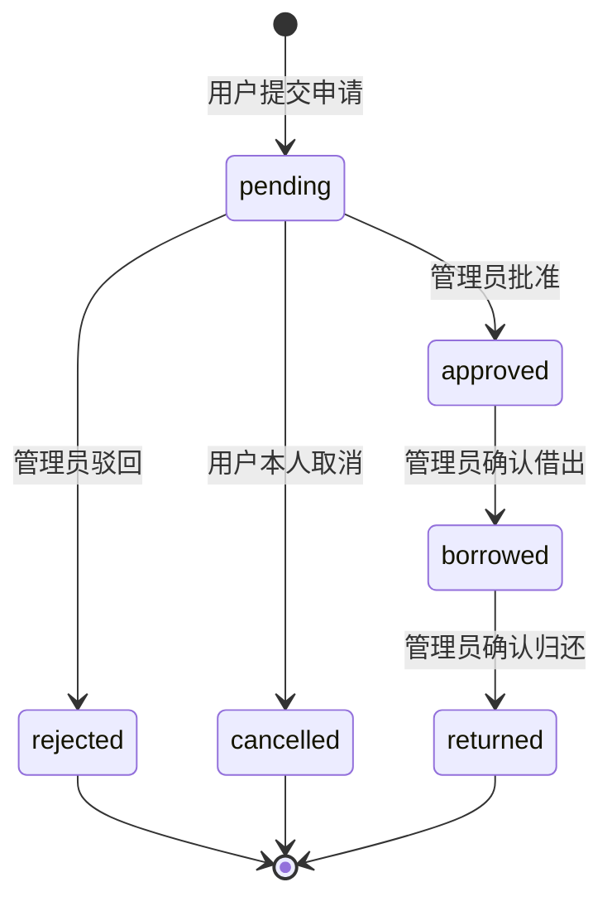
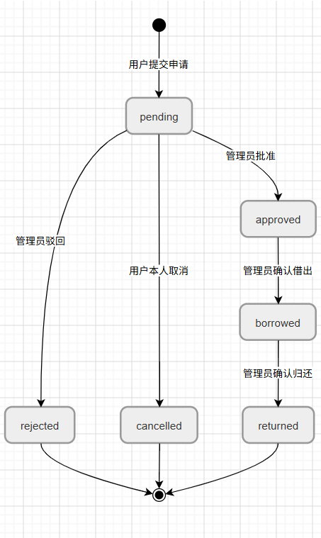

# 实验室设备借用管理系统 v2.0 设计文档

## 1. 数据表设计

版本 2.0 复用版本 1.0 的 `user`、`device`、`category` 三张核心表，并新增 `borrow_apply` 表承载借用申请与审批流程。

### borrow_apply

| 字段 | 类型 | 说明 |
|------|------|------|
| apply_id | INT | 申请 ID，主键自增 |
| user_id | INT | 申请人 ID，关联 user |
| device_id | INT | 设备 ID，关联 device |
| apply_date | DATETIME | 申请时间，系统自动写入 |
| start_date | DATE | 计划借用开始日期 |
| end_date | DATE | 计划归还日期 |
| borrow_days | INT | 后端按日期自动计算 |
| purpose_type | VARCHAR(20) | course/research/competition/other |
| purpose_note | VARCHAR(500) | 用途说明，other 时必填 |
| status | VARCHAR(20) | pending/approved/rejected/borrowed/returned/cancelled |
| audit_user_id | INT | 审批人 ID |
| audit_time | DATETIME | 审批或关键操作时间 |
| audit_note | VARCHAR(500) | 审批备注，驳回时必填 |
| actual_borrow_time | DATETIME | 实际借出时间 |
| actual_return_time | DATETIME | 实际归还时间 |
| return_note | VARCHAR(500) | 归还备注 |

主要索引：

- `idx_apply_user_status(user_id, status)`：支持我的申请分页与状态筛选。
- `idx_apply_device_period_status(device_id, start_date, end_date, status)`：支持设备时间段冲突检测。
- `idx_apply_audit_user(audit_user_id)`：支持审批人追溯。

## 2. 状态流转




状态机校验：

- 批准、驳回只能操作 `pending`。
- 确认借出只能操作 `approved`，并同步设备状态为 `borrowed`。
- 确认归还只能操作 `borrowed`，并同步设备状态为 `available`。
- 取消只能由申请人本人操作 `pending`。
- 驳回原因和归还备注必须填写，且不能只包含空格。

## 3. 时间冲突检测

系统将计划借用区间视为左闭右开区间 `[start_date, end_date)`，冲突条件为：

```sql
new_start < old_end AND old_start < new_end
```

实现位置：

- SQL：`BorrowApplyMapper.countConflict`
- Service：`BorrowApplyServiceImpl.assertNoConflict`

覆盖场景：

- 新申请被已有记录包含：冲突。
- 新申请包含已有记录：冲突。
- 两段时间局部重叠：冲突。
- `new_end = old_start` 或 `new_start = old_end`：不冲突。

提交申请时检测 `pending/approved/borrowed` 状态记录，保证同一时间段只有一个有效申请。管理员批准时再次检测 `approved/borrowed` 状态记录，避免多个待审批申请并发通过。

## 4. 分层设计

- Controller：负责页面跳转、基础参数绑定、统一 Result API。
- Service：负责字段校验、借用天数计算、状态机、冲突检测、设备状态同步。
- Mapper：负责 MyBatis SQL 映射和分页查询。
- Entity/DTO：实体类映射数据库，表单 DTO 不包含 `borrow_days`，防止客户端传入。

## 5. 管理员工作台

管理员访问系统首页时进入工作台，展示：

- 待审批申请数：`status = pending`
- 借出中设备数：`status = borrowed`
- 今日新增申请数：`DATE(apply_date) = CURDATE()`
- 设备状态汇总：available/borrowed/maintenance/retired
