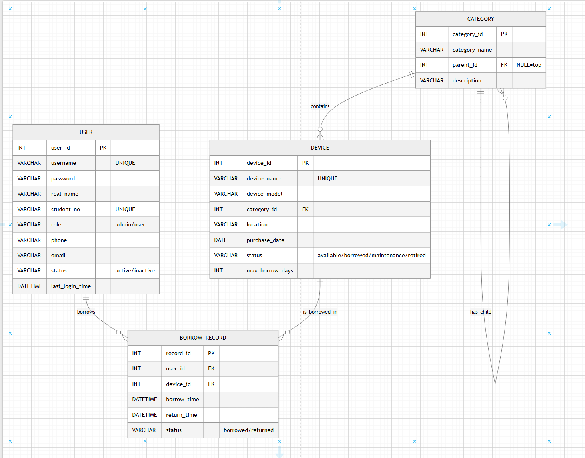

# 实验室设备借用管理系统数据库设计文档

## 1. 概念模型（ER 图）

### 实体及属性
1. **用户 (User)**
   - 属性: 用户ID(主键)、用户名、密码、真实姓名、学号/工号、角色(admin/user)、联系电话、邮箱、状态(active/inactive)、最近登录时间
2. **分类 (Category)**
   - 属性: 分类ID(主键)、分类名称、父分类ID、分类描述
3. **设备 (Device)**
   - 属性: 设备ID(主键)、设备名称、型号、所属分类ID、存放位置、购入日期、状态(available/borrowed/maintenance/retired)、最大借用天数
4. **借用记录 (BorrowRecord)** (支撑用户状态和设备状态约束校验)
   - 属性: 记录ID(主键)、用户ID、设备ID、借用时间、归还时间、状态(borrowed/returned)

### 实体间关系
- **用户 - 借用记录**: 1 对 N (一个用户可以有多次借用记录)
- **设备 - 借用记录**: 1 对 N (一台设备可以被多次借用)
- **分类 - 设备**: 1 对 N (一个分类下有多个设备)
- **分类 - 子分类**: 1 对 N (父分类下有多个子分类)

*(请在此处粘贴使用设计工具生成的 ER 图截图或将其打包进最终提交的文档目录中)*

---

## 2. 物理数据模型（数据字典）

### 2.1 用户表 (user)
记录系统登录用户及角色信息。

| 字段名 | 数据类型 | 约束/主外键 | 说明 |
| :--- | :--- | :--- | :--- |
| `user_id` | INT | PK, AUTO_INCREMENT | 用户ID，主键自增 |
| `username` | VARCHAR(50) | UNIQUE, NOT NULL | 用户名，唯一 |
| `password` | VARCHAR(100)| NOT NULL | 密码（MD5加密存储） |
| `real_name`| VARCHAR(50) | NOT NULL | 真实姓名 |
| `student_no`| VARCHAR(20)| UNIQUE, NOT NULL | 学号/工号，唯一 |
| `role` | VARCHAR(20) | NOT NULL | 角色：admin/user |
| `phone` | VARCHAR(20) | DEFAULT NULL | 联系电话 |
| `email` | VARCHAR(100)| DEFAULT NULL | 邮箱 |
| `status` | VARCHAR(20) | NOT NULL DEFAULT 'active' | 状态：active/inactive |
| `last_login_time` | DATETIME | DEFAULT NULL | 最近登录时间 |

### 2.2 设备分类表 (category)
记录设备的二级分类结构信息。

| 字段名 | 数据类型 | 约束/主外键 | 说明 |
| :--- | :--- | :--- | :--- |
| `category_id` | INT | PK, AUTO_INCREMENT | 分类ID，主键自增 |
| `category_name`| VARCHAR(50) | NOT NULL | 分类名称 |
| `parent_id` | INT | FK (关联自身 category_id) | 父分类ID，顶级为NULL |
| `description` | VARCHAR(255)| DEFAULT NULL | 分类描述 |
| `parent_id_n` | INT | 生成列 (IFNULL(parent_id, 0))| 用于辅助建立同级唯一索引 |

> **索引说明**: `UNIQUE KEY uk_category_parent_name (parent_id_n, category_name)` 保证同一父级下分类名称不重复。

### 2.3 设备表 (device)
记录实验室基础设备信息。

| 字段名 | 数据类型 | 约束/主外键 | 说明 |
| :--- | :--- | :--- | :--- |
| `device_id` | INT | PK, AUTO_INCREMENT | 设备ID，主键自增 |
| `device_name`| VARCHAR(100)| UNIQUE, NOT NULL | 设备名称，唯一 |
| `device_model`| VARCHAR(100)| NOT NULL | 型号 |
| `category_id`| INT | FK (关联 category_id) | 所属分类ID |
| `location` | VARCHAR(100)| NOT NULL | 存放位置 |
| `purchase_date`| DATE | NOT NULL | 购入日期 |
| `status` | VARCHAR(20) | NOT NULL | 状态(available/borrowed等) |
| `max_borrow_days` | INT | NOT NULL | 单次最长借用天数 |

### 2.4 借用记录表 (borrow_record)
用于支撑业务规则：若用户/设备有未归还记录(status=borrowed)，则禁止禁用用户或删除设备。

| 字段名 | 数据类型 | 约束/主外键 | 说明 |
| :--- | :--- | :--- | :--- |
| `record_id` | INT | PK, AUTO_INCREMENT | 记录ID，主键自增 |
| `user_id` | INT | FK (关联 user_id) | 借用人ID |
| `device_id` | INT | FK (关联 device_id) | 借用的设备ID |
| `borrow_time`| DATETIME | NOT NULL | 借出时间 |
| `return_time`| DATETIME | DEFAULT NULL | 归还时间 |
| `status` | VARCHAR(20) | NOT NULL | 状态：borrowed/returned |
